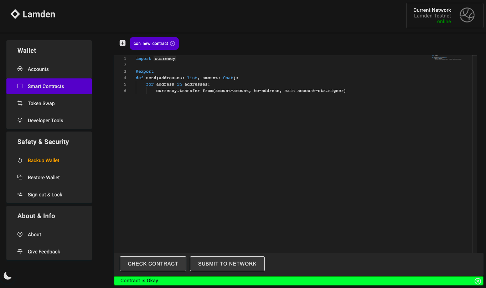

# Lamden for Python Developers

How to get started quickly developing on the Lamden blockchain

---

The [Lamden blockchain](https://lamden.io) is built heavily on smart contracts and shines with blazing fast transactions, while on top interaction is pretty easy. This short guide is meant to get you started even faster.

But first of all, why should you care? There are countless other blockchains out there, right? Well, let's see:

- In general, it's a solid custom blockchain project written in Python with a nice community and interesting properties:
  
  - No blocktime
  
  - Fees are votable
  
  - Around 100k TPS
  
  - Smart contracts in Python

- Always wanted to code smart contracts but Solidity just isn't for you? On Lamden you code and deploy Python smart contracts directly from within your browser wallet

- Team is paying a bounty of \$400 (\$200 via PayPal and \$200 worth of TAU the native coin) to anyone that creates a blockchain application in good faith

- Once you have created a smart contract you receive 90% of all transaction fees that are processed through that smart contract

## Prerequisites

### Python

Make sure to have Python 3 installed (i would recommend you use Python 3.9) alongside `python3-dev` so that you are able to build Python extensions. To install it all:

##### macOS

If you don't already have it, install the [Homebrew](https://docs.brew.sh/Installation) package manager and then install Python:

```shell
brew install python@3.9
```

That should install everything you need

##### Linux

Add the deadsnakes PPA to your system’s sources list:

```shell
sudo add-apt-repository ppa:deadsnakes/ppa
```

Then install Python:

```shell
sudo apt-get install python3.9 python3.9-dev
```

##### Windows

Download and install Python from [here](https://www.python.org/downloads/windows)

### MongoDB

You will need to install MongoDB to be able to interact with Lamden via the `lamden` module or `contracting` module. It's a hard requirement that you can't circumvent.

Please consult the [Mongo DB Docs](https://docs.mongodb.com/manual/administration/install-community) for instructions on how to install it on your operating system. After you've installed it, authentication is disabled per default and that's exactly what we need so please don't change that.

## Interact with Lamden

In general it's a good idea to check out the [Lamden GitHub](https://github.com/Lamden) but that can also be a bit confusing since there are quite a few Python repositories and it's not always immediately clear what they do or if you need them to be able to start coding on Lamden.

Here's a short overview of the Python code that you should have heard of:

[lamden](https://github.com/Lamden/lamden) - The Lamden node

- **Important for development**

- Requires MongoDB

- Install via `pip install lamden`

- This module represents the Lamden node. You don't need to run your own node to be able to develop something on Lamden but if you install it then you're ready to start since it includes everything you need. The `lamden` module depends on the `contracting` module so that you don't need to install that separately.

[contracting](https://github.com/Lamden/contracting) - Interact with smart contracts

- **Important for development**

- Requires MongoDB

- Install via `pip install contracting`

- This is what you need to be able to interact with smart contracts. But since the `lamden` module is already depending on this module, just install `lamden`.

[cilantro-enterprise](https://github.com/Lamden/cilantro-enterprise) - The **old** Lamden node

- **Outdated! Don't use**

[clove](https://github.com/Lamden/clove) - Exchange crypto via atomic swaps

- Not needed for development

- Install via `pip install clove`

[flora](https://github.com/Lamden/flora) - Distributed smart contract package manager

- Not needed for development

- Installable via `pip install flora`

[lampy](https://github.com/Lamden/lampy) - Lamden Python Client

- **Outdated! Don't use**

- You can check this out to better understand how you could write your own Lamden client but don't install this module.

[smart_contracts](https://github.com/Lamden/smart_contracts) - Example smart contracts on Lamden

- Check the examples if you want to create your own smart contract

[lamden_things](https://github.com/Lamden/lamden_things) - Example smart contracts for NFTs on Lamden

- Check the examples if you want to create your own NFT tokens

### Client Implementation

Lamden doesn't provide an official Python client implementation. There is [lampy](https://github.com/Lamden/lampy) but it's out of date and you shouldn't use it anymore. But you can surely take a look to understand how to build a client. In the end the `lamden` module is all you need and you can build on top of that.

If you need to interact with the [Masternode API](https://docs.lamden.io/docs/develop/blockchain/masternode_api) or the [Block Explorer API](https://github.com/Lamden/block-explorer-api/blob/master/api/state/config/routes.json) then you can easily write your own client or you can take a look at [this implementation here](https://github.com/Endogen/tgbf-lamden/blob/master/tgbf/lamden/api.py).

### Generate key pair

The Lamden protocol uses [ED25519](https://ed25519.cr.yp.to/) for cryptographic keys and the [PyNaCl](https://pynacl.readthedocs.io/en/stable/) library for the specific Python bindings of the original C code. If you just want to be able to generate valid key pairs then it's enough to install the `pynacl` module:

```shell
pip3 install pynacl
```

That is relatively low-level and probably not what you will end up using but generating a public address (verifying key) and a private key (signing key) would look like this:

```python
import nacl.signing
import secrets

seed = secrets.token_bytes(32)

# Signing key
sk = nacl.signing.SigningKey(seed=seed)

# Verifying key
vk = sk.verify_key

# User friendly representation of keys
address = vk.encode().hex()
privkey = sk.encode().hex()

print("address", address)
print("privkey", privkey)

# Output
# address 77b9c48aa5e43d5bff575140f484bbda55ad2a619160b5eb5c04d8f27f437686
# privkey 01c4763eadd4285cc31fdd60dedb4fa7c68f29e325775dc7f7f082bbab9b5fc9
```

If you already have a hex private key and you want to generate the seed to get the corresponding public address or sign a message or something like that:

```python
seed = bytes.fromhex(privkey)
```

You can then pass the `seed` as an argument to `SigningKey` again

### Lamden wallet

Of course Lamden has all the low-level wallet stuff including signing and verifying messages already bundled in their own `lamden` module which represents the blockchain node. You can install it with:

```shell
pip3 install lamden
```

But you need to be aware that **you will need to install MongoDB to be able to successfully install `lamden`**. No way around that.

#### Wallet creation

To instantiate a new wallet:

```python
from lamden.crypto.wallet import Wallet

# Create a new wallet with a new key pair
wallet = Wallet()

# Wallet address
address = wallet.verifying_key

# Wallet private key
privkey = wallet.signing_key

print("address", address)
print("privkey", privkey)

# Output
# address 77b9c48aa5e43d5bff575140f484bbda55ad2a619160b5eb5c04d8f27f437686
# privkey 01c4763eadd4285cc31fdd60dedb4fa7c68f29e325775dc7f7f082bbab9b5fc9
```

If you already have a private key that you want to use to instantiate your wallet, pass it as the `seed` argument to `Wallet`:

```python
from lamden.crypto.wallet import Wallet

privkey = "01c4763eadd4285cc31fdd60dedb4fa7c68f29e325775dc7f7f082bbab9b5fc9"

# Create a wallet based on the given private key
wallet = Wallet(privkey)

# Wallet address
address = wallet.verifying_key

print("address", address)

# Output
# address 77b9c48aa5e43d5bff575140f484bbda55ad2a619160b5eb5c04d8f27f437686
```

#### Signing & verifying

Once you have a `Wallet` instance you can sign and verify messages:

```python
from lamden.crypto.wallet import Wallet, verify

privkey = "01c4763eadd4285cc31fdd60dedb4fa7c68f29e325775dc7f7f082bbab9b5fc9"

wallet = Wallet(privkey)

# Let's sign this message and receive a signature
message = "Some random string"
signature = wallet.sign(message)

print("signature", signature)

# Output
# signature ba32fcfa1b975f1572a1be21efa949d29f3a9e15e064d0e8d5f90eff596a204dd20ad8ca53161224ff62e97c147aba297f9ba8fd3a1eb8223c095cf6bcc85409

# Let's verify that the message was signed by my public address
was_it_me = verify(wallet.verifying_key, message, signature)

print("was_it_me", was_it_me)

# Output
# was_it_me True
```

### Sending transaction

The next step could be to send a transaction. But before we can actually do that we need to get a [nonce](https://en.wikipedia.org/wiki/Cryptographic_nonce) from the node that will process our transaction.

#### Get a nonce

So how do we get a nonce? First of all we need to know how to connect to a node on the network. We need some masternode address:

```
Mainnet Masternode
https://masternode-01.lamden.io

Testnet Masternode
https://testnet-master-1.lamden.io
```

Next we need to understand how to communicate with a node. There is a [REST API](https://docs.lamden.io/docs/develop/blockchain/masternode_api) that we can use. Specifically the ["get transaction nonce" route](https://docs.lamden.io/docs/develop/blockchain/masternode_api#get-transaction-nonce). We can call the following URL to get a nonce for our public address (on the Testnet):

```
https://testnet-master-1.lamden.io/nonce/77b9c48aa5e43d5bff575140f484bbda55ad2a619160b5eb5c04d8f27f437686
```

The JSON reply we get looks something like this:

```json
{
    "nonce": 0,
    "processor": "89f67bb871351a1629d66676e4bd92bbacb23bd0649b890542ef98f1b664a497",
    "sender": "77b9c48aa5e43d5bff575140f484bbda55ad2a619160b5eb5c04d8f27f437686"
}
```

The `processor` is the public address (verifying key) of the node, `sender` is our own public address and `nonce` is the transaction counter for our address.

#### Stamps (fees)

We will also need to define how many [stamps](https://contracting.lamden.io/concepts/stamps) we want to use (which is basically a way to determine the maximum fee that we are willing to pay for sending a transaction - similar to gas on Ethereum). Transactions only use the stamps they need to process the given request. If you define a higher amount than needed then you won't automatically be charged that amount. Generally, a good value for `stamps` is `100`.

Stamps are converted to TAU (the native coin on the Lamden blockchain) automatically based on how much computing power is needed to process a given transaction. 

#### Coins (TAU)

To be able to send TAU around and pay for stamps we need a balance first. Let's get some Testnet TAU (also called "dTAU") so that we can try things out. There is a [Lamden Faucet](https://developers.lamden.io/testnet) that you can use once a day to get 500 dTAU.

#### Contract & function

Since Lamden is based heavily on smart contracts, every transaction that is being sent triggers a smart contract. Even sending TAU coins from one address to another executes a smart contract.

And since that is the case, we also need to specify the contract name and the function name within that contract that we want to execute with our transaction.

For a normal transfer of TAU coins the contract name is `currency` and the function name is `transfer`. To view the code of the smart contract visit [this website](https://www.tauhq.com/contracts/currency).

#### Sending

Now that we have all the details we can finally send the transaction via the [REST API](https://docs.lamden.io/docs/develop/blockchain/masternode_api#post-transaction) but please note **it's important that the node that sent us the nonce is also the one that will process the transaction**:

```python
import json
import requests

from lamden.crypto.transaction import build_transaction
from lamden.crypto.wallet import Wallet

# Wallet address
address = "77b9c48aa5e43d5bff575140f484bbda55ad2a619160b5eb5c04d8f27f437686"
# Wallet private key
privkey = "01c4763eadd4285cc31fdd60dedb4fa7c68f29e325775dc7f7f082bbab9b5fc9"

# Receiving address
to_address = "2f3d50e4528e196233617645f85c76b4c6256f307ef3c3213aabe5a6ce956900"
# Amount of TAU to send
amount = 1

# URL to get nonce for our address
url = "https://testnet-master-1.lamden.io"

nonce = requests.get(f"{url}/nonce/{address}")
nonce = json.loads(nonce.text)

# Create new wallet
wallet = Wallet(privkey)

# Build transaction
tx_data = build_transaction(
    wallet=wallet,
    processor=nonce["processor"],
    stamps=100,
    nonce=nonce["nonce"],
    contract="currency",
    function="transfer",
    kwargs={"amount": amount, "to": to_address}
)

# Send transaction
tx = requests.post(url, data=tx_data)
tx = json.loads(tx.text)
print("tx", tx)

# Get transaction hash
tx_hash = tx["hash"]
print("hash", tx_hash)

# Output
# tx {'success': 'Transaction successfully submitted to the network.', 'hash': '002c078784ccc8d273fab654f3586087c4a7b23a9745b2181d874078b4204c7f'}
# tx_hash 002c078784ccc8d273fab654f3586087c4a7b23a9745b2181d874078b4204c7f
```

#### Transaction Info

Once you have sent a transaction and received the transaction hash back, you can check the details for that transaction directly on the Block Explorer ([Testnet](https://explorer.lamden.io), [Mainnet](https://mainnet.lamden.io)) by entering your transaction hash or you can call a REST API and provide your hash as a parameter:

```
https://explorer.lamden.io/transactions/8d217a15f33bc20f018b54e2fc88f248b7bf2752c3ce84761cc31609620a12f1
```

### Smart contracts

As already said previously, Lamden is based heavily on smart contracts and thus every transaction executes a smart contract. You can get a list of all available smart contracts by calling this [REST API](https://docs.lamden.io/docs/develop/blockchain/masternode_api/#get-contracts).

To be able to interact with smart contracts you will need to install the `contracting` module but if you already installed the `lamden` module then you're fine since that depends on `contracting`.

The official documentation for smart contract development can be found [here](https://contracting.lamden.io) and you should definitely read it since this guide is only meant to give you the overall high-level picture and link everything that is important to beginners.

#### Coding

You can code a smart contract directly from within the [Chrome wallet extension](https://chrome.google.com/webstore/detail/lamden-wallet-browser-ext/fhfffofbcgbjjojdnpcfompojdjjhdim) and also test it there for basic correctness. Or if you prefer, you can use any Python IDE or editor of your choice.



#### Testing

You can test your newly created smart contract locally without the need to deploy it first to Mainnet or Testnet. Let's assume we have the following contract:

```python
@export
def hello():
    return 'Hello World'

@export
def add(a: int, b: int):
    return private_add(a, b)

def private_add(a, b):
    return a + b
```

The `hello()` method replies `Hello World` and the `add()` method can add up two Integers. This is what a smart contract on Lamden looks like. To test it locally we can do the following:

```python
# Wrap contract methods in parent method 'greeting()' 
# so that we are able to reference the contract as a whole
def greeting():
    @export
    def hello():
        return 'Hello World!'

    @export
    def add(a: int, b: int):
        return private_add(a, b)

    def private_add(a, b):
        return a + b

from contracting.client import ContractingClient

# Client to interact with local contracts
client = ContractingClient()

# Submit contract locally
client.submit(greeting)

# List all locally available contracts
print("contracts", client.get_contracts())

# Retrieve local contract
greeting = client.get_contract("greeting")

# Execute contract method 'hello()'
print("greeting - hello()", greeting.hello())
# Execute contract method 'add()'
print("greeting - add()", greeting.add(a=1, b=3))

# Output
# contracts ['submission', 'greeting']
# greeting - hello() Hello World!
# greeting - add() 4
```

As you can see it's super easy to write a contract and test it locally. There is also an article available about [how to run your own development server](https://blog.lamden.io/python-smart-contract-dev-server-f81bd605a92c).

#### Deploying

So what if you wrote a smart contract, tested it locally and now want to deploy it to the network? Here's what you do:

1. Open your [Chrome wallet](https://chrome.google.com/webstore/detail/lamden-wallet-browser-ext/fhfffofbcgbjjojdnpcfompojdjjhdim)

2. In upper right corner choose which network to connect to: **Testnet** or **Mainnet**

3. Paste the contract code into the `Smart Contracts` Tab and press the `SUBMIT TO NETWORK` button

4. Choose the account you want to use for the deployment. Then enter the contract name (needs to start with `con_`) and the max amount of stamps (per single transaction) that can be used by the contract into the form. Everything else is optional. Now hit the `SUBMIT CONTRACT` button.

5. If the contract is OK then you will be charged some TAU and your contract will be deployed to the previously chosen network.

You can also deploy the contract programmatically. Since everything on Lamden is smart contract based, even deploying smart contracts will internally trigger the `submission` contract with its `submit_contract` method. You can read more about that [here](https://contracting.lamden.io/concepts/submission).

#### Executing

Let's assume we wrote a smart contract and deployed it to the network. How can we execute it? All we need to do is send a transaction and specify the contract-name and contract-function that need to be executed.

For this example we want to execute the `con_dice` contract and its function `roll`. It doesn't need any input and will deliver a random number between 1 and 6. You can view the contract [here](https://www.tauhq.com/contracts/con_dice).

```python
import time
import json
import requests

from lamden.crypto.transaction import build_transaction
from lamden.crypto.wallet import Wallet

# Wallet address
address = "77b9c48aa5e43d5bff575140f484bbda55ad2a619160b5eb5c04d8f27f437686"
# Wallet private key
privkey = "01c4763eadd4285cc31fdd60dedb4fa7c68f29e325775dc7f7f082bbab9b5fc9"

# Get nonce for our address
url = "https://testnet-master-1.lamden.io"
nonce = requests.get(f"{url}/nonce/{address}")
nonce = json.loads(nonce.text)

# Build transaction
tx = build_transaction(
    wallet=Wallet(privkey),
    processor=nonce["processor"],
    stamps=100,
    nonce=nonce["nonce"],
    contract="con_dice",
    function="roll",
    kwargs={}
)

# Send transaction
dice_roll = requests.post(url, data=tx)
tx_hash = json.loads(dice_roll.text)
tx_hash = tx_hash["hash"]

# Wait to make sure that transaction is already processed
time.sleep(1)

# Get transaction details for given tx hash
result = requests.get(f"{url}/tx?hash={tx_hash}")
result = json.loads(result.text)
result = result["result"]
print("dice - roll", result)

# Example Output
# dice-roll 6
```

## Good to know

### Format output with decode()

REST API calls can return dictionaries that don't always include the same key. You can use `decode()` to convert the dictionaries into a structure that you can assume will not change.

```python
import requests

from lamden.crypto.wallet import Wallet
from contracting.db.encoder import decode

def get_balance(address):
    # Explorer URL
    url = "https://masternode-01.lamden.io"

    # Get balance for a given address
    res = requests.get(f"{url}/contracts/currency/balances?key={address}")
    return res.text

# Private key of wallet with balance
privkey = "17790cb73293eb1b46ac3e10bc3a62fe6826404d32635c0cfee6893d3e6a7aed"

# Create a wallet for the given privkey
wallet = Wallet(privkey)

# Wallet address
address = wallet.verifying_key

# Let's get the balance of that address
balance = get_balance(address)
print("balance", balance)
print("balance", decode(balance))

# Output
# balance {"value":{"__fixed__":"125.35"}}
# balance {'value': Decimal('125.35')}
```

### Check transaction status

If you send TAU from one address to another then check if the result includes the `error` keyword. If yes then the value of that keyword is the error message.

But if you execute a smart contract then you will always get a success message and a transaction hash back. To know if the contract was successfully executed you need to check the transaction details. **But do not check the transaction details immediately after you triggered a transaction. Wait for a second to make sure that it's processed**.

```python
import requests
import json

# Maternode URL (testnet)
url = "https://testnet-master-1.lamden.io"

# Transaction hash from triggering a smart contract
tx_hash = "66ffc0ffc5427ae2fb7b7a57137490f1ec1ace54071c1dd71e5a476d427a2079"

# Get transaction details for given tx hash
result = requests.get(f"{url}/tx?hash={tx_hash}")
result = json.loads(result.text)
print("result", result)

# Output
# {'hash': '66ffc0ffc5427ae2fb7b7a57137490f1ec1ace54071c1dd71e5a476d427a2079', 'result': 'None', 'stamps_used': 32, 'state': [{'key': 'currency.balances:77b9c48aa5e43d5bff575140f484bbda55ad2a619160b5eb5c04d8f27f437686:con_multisend', 'value': {'__fixed__': '0.0'}}, {'key': 'currency.balances:77b9c48aa5e43d5bff575140f484bbda55ad2a619160b5eb5c04d8f27f437686', 'value': {'__fixed__': '417.8461538461538465'}}, {'key': 'currency.balances:b0bb69bb8722e0b3364ada9d1d96675e8025f552e7d03770618c43b7df0584a5', 'value': 40}, {'key': 'currency.balances:523e4db1ad94e8c70d63b788b4a4356e5fd9f026b3f1b16e115386fdb70ffb4d', 'value': 30}], 'status': 0, 'transaction': {'metadata': {'signature': '13f216bdcafbb3101ce52c1306d6ed6ee848901980426ad6e5e166d61838575cc23951dae33c80da799f365ec534efc98c9f1197ada74f2606284c2e647eb701', 'timestamp': 1614641383}, 'payload': {'contract': 'con_multisend', 'function': 'send', 'kwargs': {'addresses': ['b0bb69bb8722e0b3364ada9d1d96675e8025f552e7d03770618c43b7df0584a5', '523e4db1ad94e8c70d63b788b4a4356e5fd9f026b3f1b16e115386fdb70ffb4d'], 'amount': 10}, 'nonce': 30, 'processor': '89f67bb871351a1629d66676e4bd92bbacb23bd0649b890542ef98f1b664a497', 'sender': '77b9c48aa5e43d5bff575140f484bbda55ad2a619160b5eb5c04d8f27f437686', 'stamps_supplied': 500}}}

# Check value of 'status' to know if contract was executed successfully
# status == 0 --> Success
# status == 1 --> Error
status = result["status"]
print("status", status)

# Output
# status 0
```

Once transaction details are available, check the `status` key in the JSON reply. If the value is `0` then the contract was executed successfully. If the value is `1` then something went wrong and you might want to check the `result` key to get an error message.

### Approve contract to send TAU

Writing contracts is straight forward but you should know the following: If you write a contract that is intended to spend TAU on behalf of the user then that smart contract needs to approve the amount that it wants to spend first.

Let's say you have this simple smart contract that sends out TAU to multiple addresses.

```python
import currency

@export
def send(addresses: list, amount: float):
    for address in addresses:
        currency.transfer_from(amount=amount, to=address, main_account=ctx.signer)
```

That contract actually exists and is available on Mainnet and Testnet. If you try to execute that contract then you will get a success message back.

```python
import json
import requests

from lamden.crypto.transaction import build_transaction
from lamden.crypto.wallet import Wallet

# Private key to send TAU from
privkey = "01c4763eadd4285cc31fdd60dedb4fa7c68f29e325775dc7f7f082bbab9b5fc9"

# Generate wallet to send TAU from
wallet = Wallet(privkey)

# Public address to send TAU from
address = wallet.verifying_key

# Amount of TAU to send
amount = 10

# Maternode URL (testnet)
url = "https://testnet-master-1.lamden.io"

# Get nonce for our address
nonce = requests.get(f"{url}/nonce/{address}")
nonce = json.loads(nonce.text)

# List of addresses to send TAU to
addresses = [
	"b0bb69bb8722e0b3364ada9d1d96675e8025f552e7d03770618c43b7df0584a5",
	"523e4db1ad94e8c70d63b788b4a4356e5fd9f026b3f1b16e115386fdb70ffb4d"
]

# Build transaction to trigger 'con_multisend' contract
tx = build_transaction(
    wallet=wallet,
    processor=nonce["processor"],
    stamps=500,
    nonce=nonce["nonce"],
    contract="con_multisend",
    function="send",
    kwargs={"addresses": addresses, "amount": amount}
)

# Send transaction
result = requests.post(url, data=tx)
print("con_multisend", result.text)

# Output
# con_multisend {"success":"Transaction successfully submitted to the network.","hash":"76446ec982d7abef06768169a260e9b57fec42d4de9129a9df4fb91fb64dc3f1"}
```

But if you then try to [lookup the transaction hash in the explorer](https://testnet.lamden.io/transactions/c14908ec1954f0a5b26d13f75e813d2ac329e7f07818f970ccd495ba76374ed0) you will find that the transaction (meaning the smart contract execution) didn't go through. The error is:

```
AssertionError('Not enough coins approved to send! You have 0 and are trying to spend 10',)
```

So you need to approve the contract and the amount first. Doing that means sending another transaction.

```python
# Maternode URL (testnet)
url = "https://testnet-master-1.lamden.io"

# Get new nonce for our address
nonce = requests.get(f"{url}/nonce/{address}")
nonce = json.loads(nonce.text)

# Build transaction to approve contract to spend TAU
# We need to approve double the amount since we want 
# to send 10 TAU to each of the two addresses
tx = build_transaction(
    wallet=wallet,
    processor=nonce["processor"],
    stamps=500,
    nonce=nonce["nonce"],
    contract="currency",
    function="approve",
    kwargs={"amount": float(amount * 2), "to": "con_multisend"}
)

# Send transaction
approve = requests.post(url, data=tx)
print("approve", approve.text)

# Output
# approve {"success":"Transaction successfully submitted to the network.","hash":"e3debf48c179fb96ca0f1902b348ef675d488300525a9dc7c740911f8a5aeaff"}
```

After approving let's check the approved amount

```python
# Get amount of TAU that is approved to be spent by the smart contract
key = f"{wallet.verifying_key}:con_multisend"
verify = requests.get(f"{url}/contracts/currency/balances?key={key}")
print("verify", verify.text)

# Output
# verify {"value":{"__fixed__":"20.0"}}
```

If you execute the `con_multisend` contract again after the approval then it should be possible to spend your coins as intended.

If you don't want to approve each individual amount that you want to send via smart contract for a given address then you might want to approve a very high amount that will never be reached so that you only need to do the approval once and then can spend TAU on behalf of that address indefinitely.

If you want to have that ready to be reused then you might want to take a look at this client implementation: [`get_approved_amount()`](https://github.com/Endogen/tgbf-lamden/blob/4c76df0454e923547e584d28d204598e588e3dc3/tgbf/lamden/api.py#L133) and [`approve_contract()`](https://github.com/Endogen/tgbf-lamden/blob/4c76df0454e923547e584d28d204598e588e3dc3/tgbf/lamden/api.py#L128).

## Links

Additional links to follow

- [The Tokenomics of the Lamden TAU Cryptocurrency](https://blog.lamden.io/the-tokenomics-of-the-lamden-tau-cryptocurrency-pt-1-6845e5375b6) - Project fundamentals
- [Info about Nodes, Governance and Architecture](https://developers.lamden.io/docs/lamden-core/lamden-core) - Important topics
- [Lamden for Developers](https://developers.lamden.io) - Mostly frontend developers
- [Smart contract documentation](https://contracting.lamden.io) - Mostly backend developers
- [Masternode REST API](https://docs.lamden.io/docs/develop/blockchain/masternode_api) - API to communicate with Masternodes
- [Block Explorer REST API](https://github.com/Lamden/block-explorer-api/tree/master/api) - Check out the `config` sub-folders
- [Lamden Blog](https://blog.lamden.io) - Current news and info about fundamentals
- [Mainnet Explorer](https://mainnet.lamden.io) - View transaction results on Mainnet
- [Testnet Explorer](https://explorer.lamden.io) - View transaction results on Testnet
- [Alternative Explorer with additional functionality](https://www.tauhq.com) - View dApps and smart contract code
- [Example Python API Wrapper](https://github.com/Endogen/tgbf-lamden/blob/master/tgbf/lamden/api.py) - For Masternodes API and Explorer API

## The End

Seems like you reached the end. Let's have some fun before you dive deeper into coding. Two dots, start and end. Choose one and try to get to the other.

